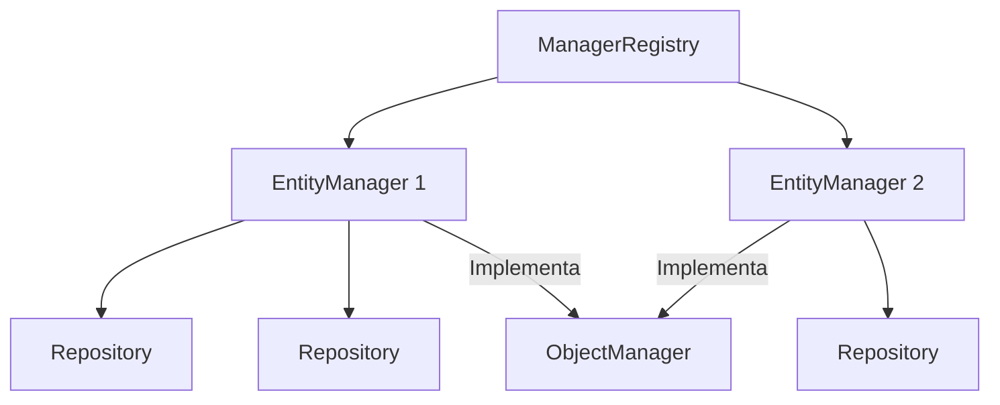

```mermaid
graph TD
    A[ManagerRegistry] --> B[EntityManager 1]
    A --> C[EntityManager 2]
    B --> D[Repository<Usuario>]
    B --> E[Repository<Producto>]
    C --> F[Repository<Log>]
    B -->|Implementa| G[ObjectManager]
    C -->|Implementa| G
```